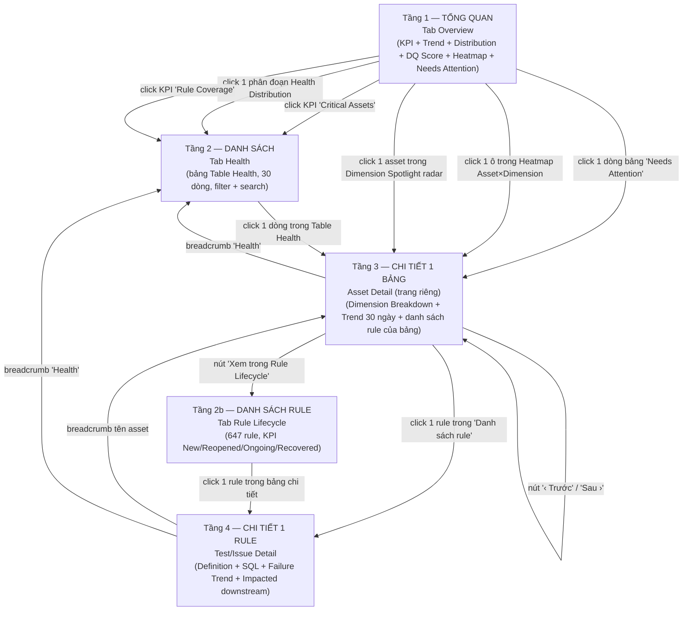

# Sơ đồ UX/UI & Cách tính toán — Data Health Dashboard

> Đọc trực tiếp từ file `index.html` bạn vừa gửi (170KB, 3 tab: Overview / Health / Rule Lifecycle) và dữ liệu mẫu thật `mock-assets.js` (30 bảng) + `mock-rules.js` (647 rule) trong `D:\HTML\JSON`. Mọi con số dưới đây là **số tính ra thật** từ dữ liệu hiện có, không phải số minh hoạ bịa ra.

---

## 1. Sơ đồ hướng đi của người dùng (UX Flow)

Dashboard có đúng **4 tầng thông tin**, đi từ tổng quát → chi tiết. Người dùng luôn có đường quay lui (breadcrumb) ở mọi tầng.



### Nguyên tắc điều hướng đã xác nhận trong code

- **3 tab ngang hàng, không lồng nhau**: Overview, Health, Rule Lifecycle — mỗi tab có **bộ filter riêng, state riêng** (`ovStatusFilters` / `healthStatusFilters` / `ruleStateFilters`...). Đổi filter ở Overview **không** làm đổi filter ở Health — đúng yêu cầu đã chốt trước đó.
- **Asset Detail và Test Detail là "trang riêng"** (`view-detail`, `view-test`), không phải modal/drawer — header và thanh tab vẫn hiển thị phía trên để bấm đổi tab ngay mà không cần quay lại trang chính trước (`switchTab` hoạt động độc lập với `showView`).
- **Mọi lối vào Asset Detail đều đi qua đúng 1 hàm** `openAssetDetail(assetId, source)` — `source` quyết định danh sách "Trước/Sau" khi bấm điều hướng (ví dụ vào từ Needs Attention thì Trước/Sau duyệt qua đúng danh sách Needs Attention, vào từ Heatmap thì duyệt qua danh sách Heatmap) — không có 2 cách mở trang chi tiết khác nhau cho cùng 1 khái niệm.
- **KPI card có `class="clickable"` mới bấm được** — 2 trong 4 KPI của Overview (Critical Assets, Rule Coverage) là lối tắt sang tab Health kèm filter dựng sẵn; 2 KPI còn lại (Điểm TB của các bảng, Last Full Scan) chỉ để đọc, không click.

---

## 2. Cách tính toán — từ công thức gốc đến từng con số hiển thị

### 2.0. Nguồn dữ liệu

Có 2 nguồn, **không trộn lẫn**:

- `mock-assets.js` — 30 bảng (`asset_001`…`asset_030`), mỗi bảng có `domain`, `owner`, `tier`, `recordCount`, `failingDimensions`, và lịch sử 30 ngày `history30d[]`.
- `mock-rules.js` — 647 rule (test case), mỗi rule gắn với 1 `assetId` + 1 `healthDimension` (Accuracy/Completeness/Uniqueness/Validity/Consistency/Freshness), có `latestResult` (Pass/Fail/null) và các trường vòng đời (`lifecycleState`, `recurrenceCount`…).

**Điểm quan trọng nhất**: bản code hiện tại **không còn đọc field `healthScore`/`healthDimensions` có sẵn trong JSON** của asset nữa (đó là số "bake sẵn", từng gây bug: 3 bảng không có rule nào vẫn hiện điểm cao + badge Healthy). Toàn bộ điểm số bây giờ được **tính lại từ tỉ lệ Pass/Fail thật của rule** trong `mock-rules.js`. Đây là thay đổi lớn nhất so với bản trước.

### 2.1. `dimensionScore(asset, dim)` — điểm của 1 chiều chất lượng, trên 1 bảng

```
dimensionScore = (số rule Pass gần nhất / số rule ĐÃ CHẠY của dimension đó) × 100
```

- Rule có `latestResult = null` (đã tạo nhưng chưa chạy lần nào) → **loại khỏi mẫu số**, không tính là Fail.
- Nếu dimension đó không có rule nào từng chạy → trả về `null` ("chưa đo được"), khác hẳn điểm 0 ("có đo, nhưng toàn Fail").

**Ví dụ thật — bảng `customer` (`asset_001`)**, tra trực tiếp từ `mock-rules.js`:

| Dimension | Rule đã chạy | Pass | dimensionScore |
|---|---|---|---|
| Accuracy | 5 | 1 | 20 |
| Completeness | 5 | 0 | 0 |
| Uniqueness | 4 | 2 | 50 |
| Validity | 5 | 3 | 60 |
| Consistency | 3 | 1 | 33 |
| Freshness | 5 | 0 | 0 |

### 2.2. `healthScore(asset)` — điểm tổng của 1 bảng

```
healthScore = trung bình cộng của 6 dimensionScore (bỏ qua dimension = null)
```

Với `customer`: (20 + 0 + 50 + 60 + 33 + 0) / 6 = **27.17 → làm tròn 27/100**.

27 < ngưỡng `amber = 70` → trạng thái **Critical**, màu đỏ ở mọi nơi trên dashboard (badge, ô heatmap, dòng trong bảng) — vì tất cả đều đọc từ đúng 1 hàm `statusForScore()` + 1 hằng số `THRESHOLDS = { green: 90, amber: 70 }`.

```
statusForScore(score):
  null        → Unmonitored (chưa có rule nào đo được dimension nào)
  ≥ 90        → Healthy
  70–89       → Warning (hiển thị "Degraded")
  < 70        → Critical
```

### 2.3. KPI "Điểm TB của các bảng" (Overview, góc trên trái)

```
= Σ healthScore của các bảng ĐÃ ĐƯỢC GIÁM SÁT trong tập đang lọc / số bảng đã giám sát
```

- "Đã giám sát" = có ít nhất 1 dimension đo được (`healthScore ≠ null`). Bảng chưa có rule nào (Unmonitored) bị **loại khỏi cả tử số lẫn mẫu số** — không tính là 0 điểm, không tính là 100 điểm.
- Đổi filter (Domain/Owner/Health status/Dimension) → con số này đổi theo, vì tính trên **tập đang lọc**.

**Số thật với filter mặc định (không lọc gì, cả 30 bảng)**:
- 30 bảng, nhưng chỉ **27 bảng** có ít nhất 1 rule từng chạy → **3 bảng Unmonitored**: `payment`, `subscriptions_057`, `kyc_check`.
- Trung bình cộng `healthScore` của 27 bảng còn lại = **68/100**.
- Dòng chú thích tự sinh bên dưới đúng như code: *"Overview 68/100 — tính trên 27/30 asset. 3 asset chưa được giám sát."*

### 2.4. "Data Quality Score — Toàn hệ thống" (card radar bên dưới)

Đây là chỉ số **cố định, KHÔNG đổi theo filter bar** — trả lời câu hỏi khác hẳn KPI 2.3 ("cả hệ thống đang ở đâu", không phải "tập tôi đang xem đang ở đâu"). Tính qua **2 tầng**:

**Tầng 1 — với từng dimension trong 6 dimension, lấy trung bình CÓ TRỌNG SỐ theo `recordCount`, trên TOÀN BỘ 30 bảng:**

```
weighted(dim) = Σ (dimensionScore(bảng, dim) × recordCount(bảng)) / Σ recordCount(bảng)
```

Bảng nào có nhiều dòng dữ liệu hơn thì "phiếu bầu" nặng hơn — đúng yêu cầu nghiệp vụ "bảng lớn phải ảnh hưởng nhiều hơn bảng nhỏ".

**Tầng 2 — cộng 6 con số đã tính ở Tầng 1, chia 6 (KHÔNG trọng số lần nữa):**

**Số thật tính ra từ dữ liệu hiện có:**

| Dimension | Điểm có trọng số theo recordCount |
|---|---|
| Accuracy | 89 |
| Completeness | 68 |
| Uniqueness | 94 |
| Validity | 91 |
| Consistency | 94 |
| Freshness | 87 |

→ Data Quality Score = (89+68+94+91+94+87)/6 = **87.0/100** → badge "Tốt" (≥90? — thực ra 87 rơi vào khoảng 70–89 nên đúng ra phải là **"Cảnh báo"**, không phải "Tốt"; nếu dashboard hiện đang hiện badge xanh cho 87 thì đây là điểm cần soát lại, xem mục Lưu ý bên dưới).

**Tại sao 68 (mục 2.3) và 87 (mục này) lệch nhau tới ~19 điểm?**
Vì một bảng cực lớn đang khoẻ hơn mặt bằng chung: `web_sessions` (`asset_030`) có `recordCount = 90.000.000`, chiếm **65,3%** tổng số dòng dữ liệu toàn hệ thống (137.860.680 dòng). Khi tính "mỗi dòng dữ liệu = 1 phiếu bầu" thay vì "mỗi bảng = 1 phiếu bầu", điểm của riêng bảng này gần như quyết định kết quả chung, kéo điểm hệ thống lên cao hơn hẳn so với cách tính trung bình cộng đơn giản theo bảng.

Đây chính xác là lý do banner cảnh báo `DQ_WEIGHT_WARNING_PCT = 60%` xuất hiện: bất kỳ khi nào 1 bảng chiếm >60% tổng `recordCount`, dashboard tự in dòng: *"Asset web_sessions chiếm 65% tổng record count — điểm toàn hệ thống có thể bị 1 asset này chi phối."*

### 2.5. Rule Coverage (KPI thứ 3, Overview)

```
= số bảng có ≥ 1 rule / tổng số bảng trong tập đang lọc
```
Số thật (không lọc): 27/30 = **90%**. Ngưỡng màu thanh progress là `COVERAGE_THRESHOLDS = {green:90, amber:70}` — **khai báo riêng** với `THRESHOLDS` dùng cho điểm chất lượng, dù trùng giá trị 90/70, vì bản chất đại lượng khác nhau (tỉ lệ có-rule-hay-không, không phải điểm chất lượng).

### 2.6. Needs Attention (bảng cuối tab Overview)

```
Điều kiện vào danh sách: bảng có failingDimensions.length > 0 (trong mock-assets.js)
Sắp xếp: healthScore tăng dần (bảng tệ nhất lên đầu; bảng null xếp cuối, không coi là tệ nhất)
Top-N hiển thị: 5/10/20 theo dropdown, độc lập với filter bar
```

### 2.7. Rule Lifecycle — 4 KPI trạng thái

Đọc trực tiếp field `lifecycleState` của từng rule trong 647 rule. Số thật hiện có:

| Trạng thái | Ý nghĩa | Số rule |
|---|---|---|
| New | Lỗi phát sinh lần đầu | 42 |
| Reopened | Đã sửa nhưng lỗi lại | 27 |
| Ongoing | Đang fail liên tục | 138 |
| Recovered | Vừa hết lỗi | 0 |

Còn **440 rule ở trạng thái "Stable"** (đang Pass ổn định) — không xuất hiện trong 4 KPI này vì 4 ô này cố tình chỉ theo dõi rule "có vấn đề cần chú ý", không phải liệt kê toàn bộ 647 rule.

Bảng "Top Rule Bất Ổn" sort theo `recurrenceCount` (số lần tái phát) giảm dần — ví dụ rule tái phát nhiều nhất hiện tại: `customer_accuracy` (bảng `customer`) và `customer_accuracy_4`, `customer_completeness` — đều `recurrenceCount = 2`.

### 2.8. Ngưỡng phụ — `HEALTH_STATUS_BUCKET` (chỉ dùng cho so sánh "hôm qua")

Vì `history30d` chỉ lưu điểm số liên tục (số), không lưu lại trạng thái Critical/Warning/Healthy của từng ngày trong quá khứ, dashboard cần suy ngược trạng thái từ điểm số khi tính "▲/▼ so với hôm qua". Ngưỡng này (`criticalMax:50, warningMax:80`) **cố tình khác** `THRESHOLDS` chính (90/70) — không phải sai sót, mà vì dữ liệu mock hiện tại có khoảng trống tự nhiên (không bảng nào có điểm 33–65 hay 70–88) nên chọn mốc nào trong khoảng trống đó cũng cho cùng 1 kết quả phân loại; code đã ghi rõ comment giải thích, không phải ngưỡng bị quên đồng bộ.

---

## 3. Vì sao chọn từng loại card/chart — lý do thiết kế

| Vị trí | Loại hiển thị | Lý do chọn |
|---|---|---|
| Overview — hàng đầu | 4 **KPI card** số lớn | Theo IBCS "Say": người xem cần thấy ngay 4 con số quan trọng nhất (điểm TB, số bảng nguy hiểm, độ phủ rule, độ mới của lần scan) trước khi đọc bất kỳ biểu đồ nào. Card nào có hành động tiếp theo rõ ràng (Critical, Rule Coverage) mới cho click — tránh người dùng bấm nhầm vào số chỉ để đọc. |
| Health Distribution | **Stacked bar 100%** (không dùng donut) | Donut tốt cho "tỉ lệ 1 phần trên tổng" nhưng rất khó so sánh 2 thời điểm cạnh nhau (2 vòng tròn chồng lên nhau không đọc được). Stacked bar cho phép đặt thanh "hôm nay" và thanh "kỳ trước" song song, cùng gốc 0%, so sánh trực tiếp bằng mắt — đúng nguyên tắc IBCS "Express: chọn đúng loại chart cho mục đích so sánh", không phải mục đích tỉ lệ đơn thuần. |
| Data Health Trend | **Line chart + 2 ngưỡng nét đứt (Target/Ngưỡng)** | Time-series bắt buộc dùng line, không dùng bar (bar hợp với so sánh rời rạc, không hợp thể hiện xu hướng liên tục). 2 đường ngưỡng nét đứt tại 90/70 để người xem không phải nhớ ngưỡng trong đầu — đúng rule "Check: Actual luôn cần Target đi kèm", không vẽ 1 chỉ số trơ trọi không có baseline. |
| Data Quality Score | **Radar 6 trục + lớp "Mục tiêu" nét đứt chồng lên** | Radar là loại duy nhất thể hiện được "hình dạng mạnh/yếu" của 6 chiều cùng lúc trong 1 hình — nhìn là biết ngay dimension nào lệch khỏi mục tiêu nhiều nhất, thay vì phải đọc lần lượt 6 con số riêng lẻ. Radar phụ (Dimension Spotlight) dùng 3 màu cho 3 bảng điểm thấp nhất — mở rộng từ "hệ thống nói chung" sang "ai đang kéo điểm xuống", là lối vào tự nhiên để click sang Asset Detail. |
| Chất lượng theo Asset × Dimension | **Heatmap (lưới màu)** | Đây là bảng dữ liệu 2 chiều (bảng × dimension) — heatmap là cách duy nhất nhìn ra pattern (ví dụ: cả 1 domain cùng yếu 1 dimension) mà không phải đọc từng ô số. Có Top 5/10/20/Tất cả để cân bằng giữa "đủ thông tin" và "không tràn màn hình". |
| Needs Attention, Table Health, Rule Lifecycle | **Bảng (table)**, sort sẵn theo mức độ nghiêm trọng | Khi người dùng cần hành động cụ thể trên từng dòng (xem chi tiết, giao việc), bảng luôn đúng hơn chart — chart chỉ tốt cho "nhận diện xu hướng/ngoại lệ", bảng mới cho đủ thông tin để thao tác (Owner, Primary Issue, thời gian). Đây cũng là tầng 2 của cấu trúc 4 tầng, đúng vai trò "danh sách trung gian" trước khi vào chi tiết 1 bảng. |
| Asset Detail | **KPI + Dimension Breakdown (bar) + Trend riêng (line) + bảng rule của asset đó** | Lặp lại đúng bộ ngôn ngữ hình ảnh đã dùng ở Overview (không phát minh loại chart mới ở tầng chi tiết) — người dùng không phải học lại cách đọc biểu đồ khi đi sâu hơn, chỉ thu hẹp phạm vi dữ liệu từ "toàn hệ thống" xuống "1 bảng". |
| Test/Issue Detail | **Bảng key-value (định nghĩa rule) + code block (SQL) + line chart nhỏ (failure trend riêng của rule)** | Đây là tầng điều tra nguyên nhân gốc — cần đúng câu SQL đang chạy và lịch sử fail của riêng rule đó, không cần biểu đồ tổng hợp nào nữa vì phạm vi đã thu hẹp về 1 rule duy nhất. |

---

## 4. Một điểm cần soát lại (phát hiện khi tính tay)

Khi tính tay theo đúng công thức trong code, Data Quality Score toàn hệ thống hiện tại ra **87/100**, rơi vào khoảng `70–89` → theo `dqStatusFor()` phải là badge **"Cảnh báo"** (màu cam), **không phải "Tốt"** (màu xanh, chỉ dành cho ≥90). Nếu ảnh chụp màn hình gần nhất của bạn đang hiện badge xanh cho con số quanh 85–87, đây là điểm nên nhờ agent code kiểm tra lại — có thể do dữ liệu đã thay đổi kể từ lúc chụp, hoặc do một chỗ nào đó chưa đọc đúng từ `dqStatusFor()`.
